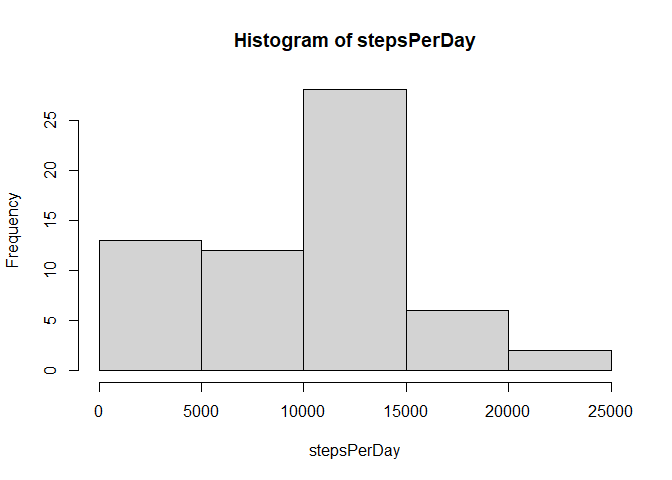

## Loading and preprocessing the data
First, the table is read using a simple read.csv command

```r
activity_data <- read.csv("activity.csv")
str(activity_data)
```

```
## 'data.frame':	17568 obs. of  3 variables:
##  $ steps   : int  NA NA NA NA NA NA NA NA NA NA ...
##  $ date    : chr  "2012-10-01" "2012-10-01" "2012-10-01" "2012-10-01" ...
##  $ interval: int  0 5 10 15 20 25 30 35 40 45 ...
```
Note that the items in the date column are in character format. They should be converted to date

```r
activity_data$date <- as.Date(activity_data$date)
```

## What is mean total number of steps taken per day?
Total steps per day can be calculated using tapply, ignoring the NA values by specifing na.rm = TRUE

```r
stepsPerDay <- with(activity_data, tapply(steps, date, sum, na.rm = TRUE))
```
Histogram can be plotted with this data  

```r
hist(stepsPerDay)
```

<!-- -->
  
The mean and median are calculated below.

```r
mean(stepsPerDay)
```

```
## [1] 9354.23
```

```r
median(stepsPerDay)
```

```
## [1] 10395
```
## What is the average daily activity pattern?
The number of steps taken in an interval averaged across all days can be calculated similarly to stepsPerDay

```r
stepsPerInterval <- with(activity_data, tapply(steps, interval, mean, na.rm = TRUE))
```
Time series plot of the data:

```r
plot(names(stepsPerInterval), stepsPerInterval, type = "l", xlab = "Interval", ylab = "Average Steps")
```

<!-- -->

The interval with maximum steps can be found as

```r
maxStepsInterval <- names(stepsPerInterval)[which.max(stepsPerInterval)]
print(maxStepsInterval)
```

```
## [1] "835"
```
It is observed that interval ``835`` is the interval with maximum average steps throughout the day

## Imputing missing values
The dataset has missing (NA) values. The total number of these can be calculated to be

```r
sum(is.na(activity_data$steps))
```

```
## [1] 2304
```
The missing values can be imputed by replacing them with the mean for that particular interval, since in the above time series plot it is observed that throughout the day the number of steps varies dramatically

```r
library(dplyr)
imputed_data <- activity_data %>% mutate(steps = ifelse(is.na(steps), mean(activity_data[activity_data$interval == interval, "steps"], na.rm = TRUE), steps))
```
We now calculate the total steps taken each day for the imputed data, and plot a histogram for the data.

```r
newStepsPerDay <- with(imputed_data, tapply(steps, date, sum))
hist(newStepsPerDay)
```

<!-- -->

The new mean and median values of the data are calculated below

```r
mean(newStepsPerDay)
```

```
## [1] 10766.19
```

```r
median(newStepsPerDay)
```

```
## [1] 10766.19
```
Evidently, imputing the missing values caused these measures to rise fairly significantly. In particular, it now appears that the mean and median are effectively identical. The estimated total steps per day is significantly higher

## Are there differences in activity patterns between weekdays and weekends?
We can create a factor variable to denote weekends and weekdays

```r
weekdays <- as.factor(ifelse(weekdays(imputed_data$date) %in% c("Saturday", "Sunday"), "weekend", "weekday"))
imputed_data <- imputed_data %>% mutate(day = weekdays)
```
We then find the mean for steps taken in an interval, averaged across all weekdays or weekend days

```r
newStepsPerInterval <- imputed_data %>% group_by(day, interval) %>% summarise_at("steps", mean)
```
A panel plot can be constructed from this modified data

```r
library(ggplot2)
with(newStepsPerInterval, qplot(interval, steps, facets = day~., geom = "line"))
```

<!-- -->
